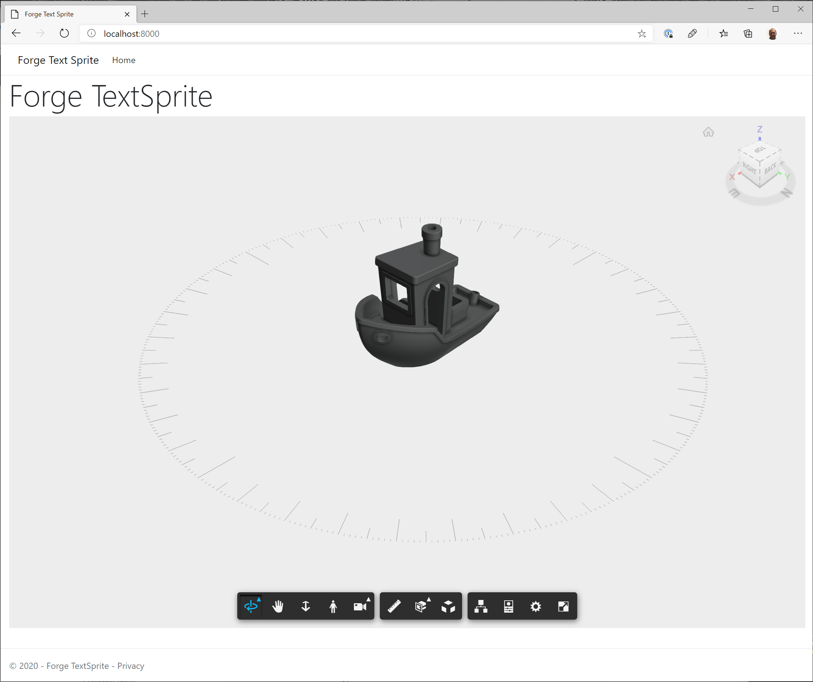

# ForgeTextSprite

Example project attempting to display text sprites in the Autodesk Forge Viewer.

The project displays a compass rose underneath the loaded model. 
Although the degrees of the compass are displayed OK, the text for the cardinals (N, S, E, W) is not displayed.

The TextSprite.ts was converted to Typescript from [three-spritetext](https://github.com/vasturiano/three-spritetext).
I commented out the usage of THREE.LinearFilter as that doesn't seem to be present in the Forge viewer.

## Quick start

Open a terminal window in the project root and run the following:

`npm install`

Update `src/index.html` with a valid access token and urn from Autodesk Forge.

`npm run dev`

Open a web browser at [http://localhost:8000](http://localhost:8000)

